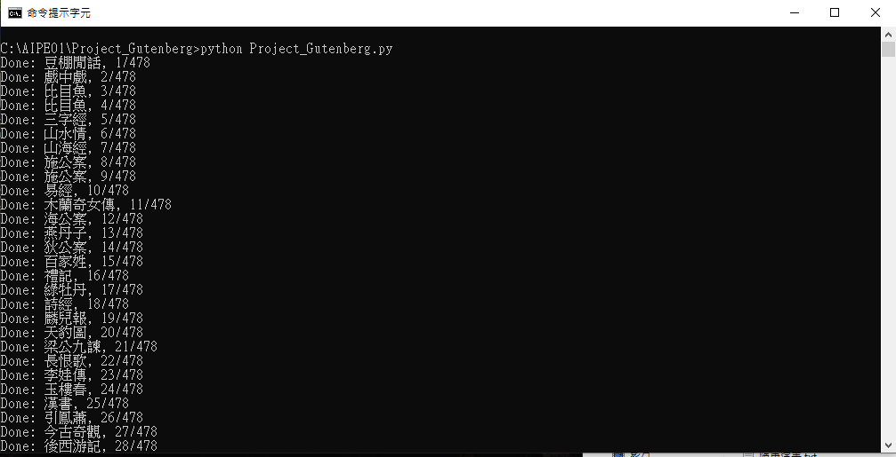

# Project Gutenberg
爬取中文書籍，共 384 本。

## 安裝套件
- requests  2.32.3
- beautifulsoup4 4.13.4

## 成果


* 執行影片連結


## 程式碼說明

* 導入套件
```
from bs4 import BeautifulSoup as bs
import requests as req
from pprint import pprint
import re, os
```

* get 網站入口
```
url = 'https://www.gutenberg.org/browse/languages/zh'
prefix = 'https://www.gutenberg.org/'
res = req.get(url)
soup = bs(res.text, 'lxml')
list_post = []
```

* 將書名和超連結append進列表
```
def get_list_post_info():
    list_post.clear()

    for a in soup.select('ul a'):
        rg1 = r"[\u4E00-\u9FFF]+"
        a_title = a.get_text()
        a_title = re.sub(r'[\r\n]', '', a_title)
        if re.match(rg1, a_title) != None:
            
            list_post.append({
                'title': a_title,
                'link': prefix + a['href']
            }) 
```

* 取得內文檔的url並加入列表
```
def get_link_text():
    for index, obj in enumerate(list_post):
        res_ = req.get(obj['link'])
        soup_ = bs(res_.text, 'lxml')
        link_text = prefix + soup_.select_one('a.link.read_html')['href']
        list_post[index]['link_text'] = link_text
```

* 用os建立資料夾
* 定位\<p\>標籤爬取內文
* 寫進txt檔
* 用print紀錄程式執行進度
```
def get_text():
    if not os.path.exists('Project_Gutenberg'):
        os.makedirs('Project_Gutenberg')

    for index, obj in enumerate(list_post):
        res_2 = req.get(obj['link_text'])
        soup_2 = bs(res_2.text, 'lxml')

        for p in soup_2.select('p'):
            if p.has_attr('id') == True:
                p_text = p.get_text()
                with open(f"Project_Gutenberg/{list_post[index]['title']}.txt", 'a', encoding='utf-8') as file:
                    file.write(p_text)

        print(f"Done: {obj['title']}, {index+1}/{len(list_post)}")
```

* call function
```
def main():
    get_list_post_info()
    get_link_text()
    get_text()

if __name__ == '__main__':
    main()
```
